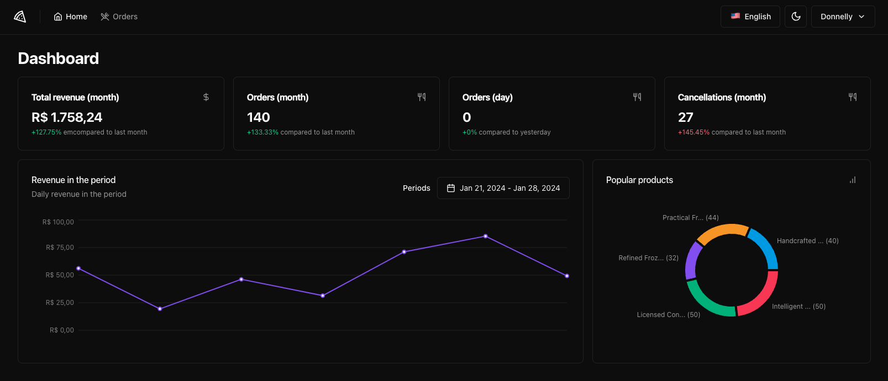
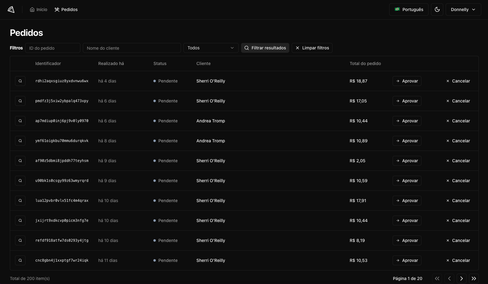
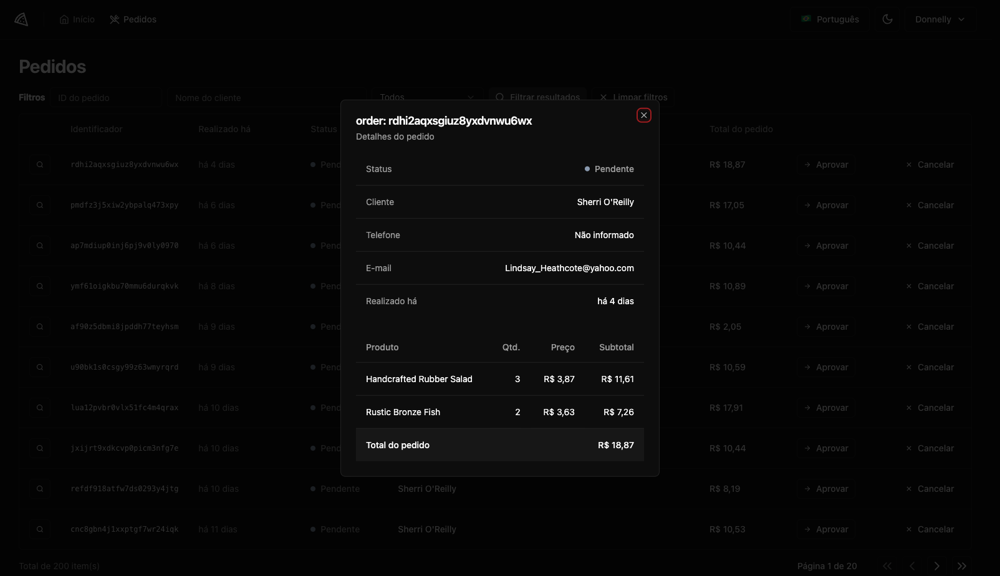

# 🍕 Ignite - pizzashop

Projeto feito durante o Ignite da Rocketseat, construído com vite e estilizado com tailwindcss junto dos componentes da biblioteca shadcn-ui. O projeto é um dashboard de vendas, para acompanhar pedidos, atualizar status e ter controle de vendas com gráficos. Além disso, o projeto possui internacionalização com i18n, incluindo inglês, espanhol e português.

## Índice

- [Capturas de Tela](#capturas-de-tela)
- [Requisitos de Instalação](#requisitos-de-instalação)

## Capturas de Tela

<div align="center">
  <div style="display: flex; gap: 16px; align-items: center">
   
   
   
  </div>
</div>

## Requisitos de Instalação

Para executar o projeto, siga os passos abaixo:

```bash
1. Clone este repositório em sua máquina
$ git clone https://github.com/ViniciusPonte/devstore-ignite.git

2. Instale as dependencias
$ npm i

3. Rode o projeto através do comando:
$ npm run dev

4. Para utilizar a API do projeto, é necessário clonar o repositório abaixo.
$ git clone https://github.com/rocketseat-education/pizzashop-api.git

5. Altere no arquivo "src/db/seed.ts" a linha 58 para o seu e-mail.

6. Instale o Bun.
$ https://bun.sh/

6. Após clonar o repositório da API e instalar o Bun, baixe e instale o Docker.
$ https://www.docker.com/get-started/

7. Após a instalação e execução do Docker, execute os seguintes comandos:
$ docker compose up -d (executa a imagem do docker na maquina)
$ bun i (instalar as dependencias)
$ bun migrate (gerar as migrations do banco de dados)
$ bun seed (popular o banco de dados com algumas informações)
$ bun dev (executa a aplicação)
